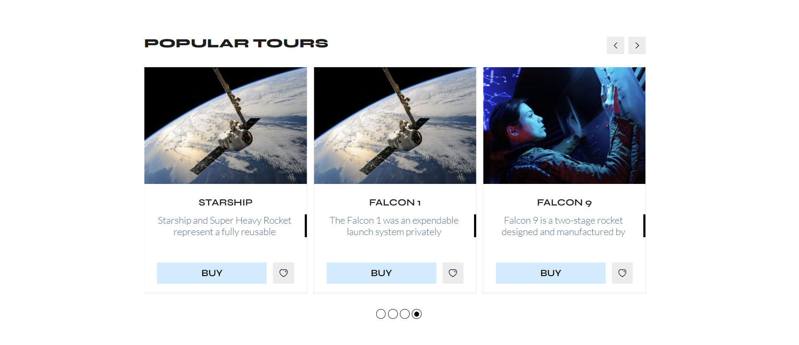

# SpdLoad_test

This project was created using [npx create-react-app my-app --template typescript].

During the project's development, the following libraries were utilized:

For styling: styled-components, slick-carousel. For database operations: @apollo/client,
Recoil.
The application consists of two pages:
Home: The home page features a hero section with dynamic content and a gallery of flights.

Favorites: The Favorites page automatically displays the flights that users have
selected as favorites. Users can manage this list (remove flights from favorites).

A navigation menu is available on each page for quick site navigation.

